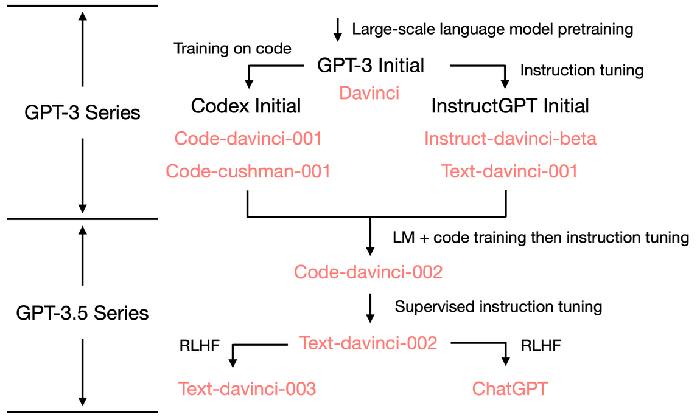
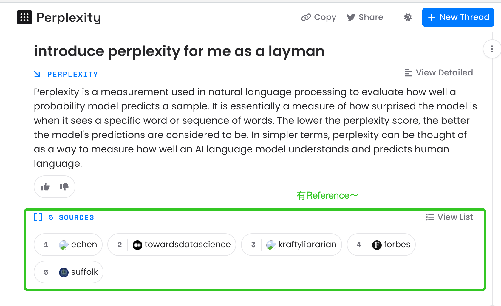
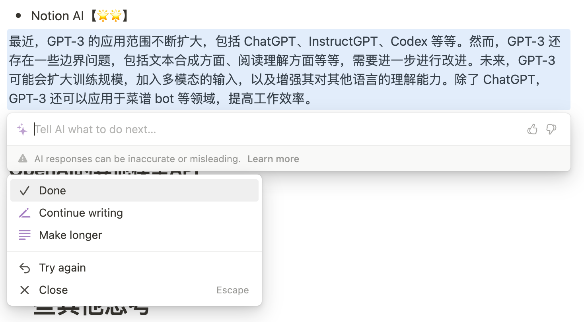
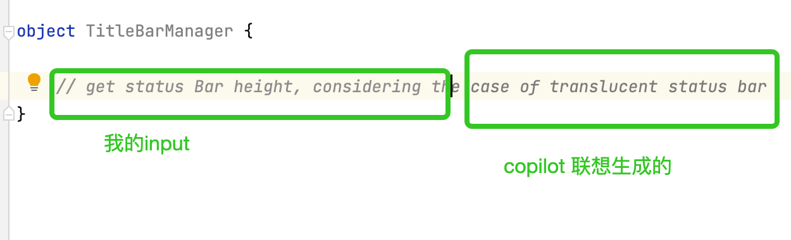
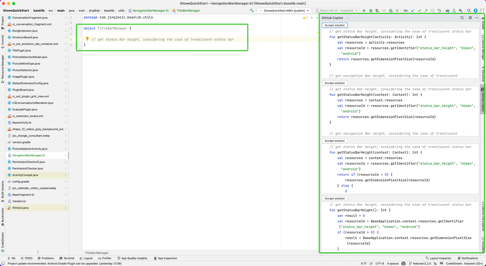
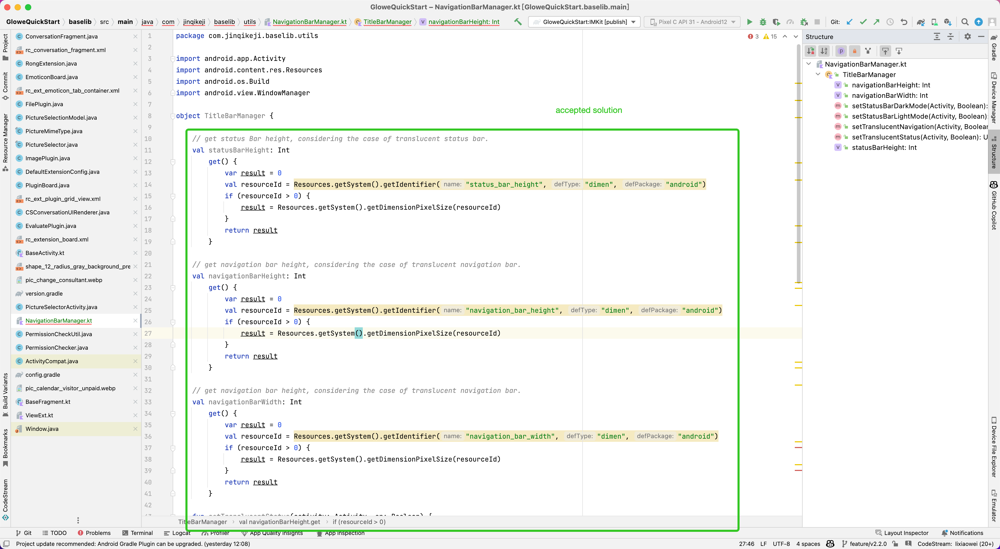

+++ 
title = "GPT3 分享" 
date = 2023-08-15 
+++

***Category***

[前情提要](#前情提要) / [GPT-3 介绍](#gpt-3-介绍) / [ChatGPT体验](#chatgpt体验)  / [GPT-3 的应用](#gpt-3-的应用) / [一些其他思考](#一些其他思考) 

---

# 前情提要

> 这里「GPT-3」仅模糊地指代 GPT-3 模型与 GPT-3.5 模型，不做严格区分，因为两种模型的训练方式是基本一致的，主要区别在于参数规模，这也是 InstructGPT 与 ChatGPT 的主要区别之一。
> 

*你跟ChatGPT聊过天了吗？*

我们除了跟ChatGPT聊天还能做什么？你愿意为了ChatGPT改变你的提问方式吗？ChatGPT可以怎样提高我们的效率？你认可ChatGPT作为一个工具的存在吗？GPT-4来了，它与ChatGPT会有什么区别呢？

从介绍 ChatGPT 的家族模型 GPT-3 开始，希望让 ChatGPT 更加立体，对这个黑盒有新的观察角度。

# GPT-3 介绍

ChatGPT 与 它的原型 InstructGPT 都是基于 GPT-3 模型 fine-tuned 的结果。了解 GPT-3 模型是如何进行训练的，我们也就更能理解 ChatGPT 擅长以及不擅长什么。

> Paper address: [Language Models are Few-shot Learners](https://arxiv.org/abs/2005.14165)
> 
> 论文笔记：[GPT3 - Note](https://www.notion.so/.GPT3-Note-792d2dd06aa94a65a5473567730fed21?pvs=21)
>

GPT 即 **Generative Pre-trained Transformer**，从它的名字可以看出这个模型使用了 transformer 语言模型的方式进行了**泛化的预训练**。预训练完成的 GPT-3 经过 fine-tuning 之后便得到了 ChatGPT。我们会说 GPT 是一个**自回归**的 transformer，这是指它的预训练方式是**无监督**的，并且能够动态地将**前序的上下文信息**加入到输入中来决定输出。这也是 GPT 与 RNN （Recurrent Neural Network，前一代语言处理的主流模型之一）的区别所在，即在利用前序输入的时候，相对 RNN 的 **short-term denpendency**，GPT 具有 long-term 的特点 —— 这里（长期）依赖是指模型能否根据（迄今为止的所有）输入来决定输出，RNN 同样具有这个能力，只是它的依赖更短期，即**上下文窗口**更小。

> 为啥要无监督训练呢？对于**语言处理**来说，学习语言结构的方法相比词句概率统计来说可以获得更好的结果，通用的无监督方法相比早期的有监督方法更擅长学得语言结构。此外，无监督方式具有更好的泛化能力。
> 

## GPT-3 如何进行 Fine-tuning

*Reference: [Introducing ChatGPT](https://openai.com/blog/chatgpt). Fine-tuning 的过程都是有监督的。第一步是 **few-shot learning**，模型在一个prompts构成的小数据集上进行学习，标注员对输出做 ranking。这一步之后模型将更加 task-specific（tasks指 生成代码/生成文章/完形填空）。第二步是通过人工构建少量样本来训练一个小的**反馈模型**，小模型用于对下一步大模型的输出结果进行评判。这一步中的少量样本将约束模型的输出应该应该具有什么样的格式/风格。第三步将小反馈模型与大模型**串联**起来，辅助大模型再优化输出的表达方式。*

了解一个模型时，可以把它看成一个串联了很多函数的超级函数，它需要一个输入，最后有一个输出，人设定的任务目标将约束它的输出。GPT-3 作为一个语言模型，它的原始输入是文本，最终输出也是文本，它的任务是学习文本生成，因此它的输出文本不是简单的复制粘贴，而是类似统计概率，将预测具有最大出现概率的词作为输出。

GPT-3 的训练数据是海量的文本数据集，这些文本数据来源占比从大到小有 公共网页数据（Common Crawl），有Reddit的博文数据（WebText2），书籍（Books1+Books2），与一些英文维基百科。

*Reference: [2023 LifeArchitect.ai data - Contents of GPT-3/Pile/Megatron/CC](https://docs.google.com/spreadsheets/d/1O5KVQW1Hx5ZAkcg8AIRjbQLQzx2wVaLl0SqUu-ir9Fs/edit#gid=0)*

而模型训练的过程是反复学习输入，达到设定输出的过程。GPT 的输入在这个过程中得到了负责纠偏的 **prompt** 的增强。这里 prompt ****是指人定义了一个标准答案，告诉模型期望的输出应该是这样的格式。我们说 GPT-3 的训练方式是 Few-shot learning，这里 **Few-shot** 就是指这样的 prompts（有时也用 demonstration 来描述）。

> Prompt 的加入是为了纠偏，为什么需要纠偏呢？因为模型的输出与标准答案之间的差距太大了。我们有 函数 cost reduction 来衡量这个差距：cost reduction 越快越多，就说明模型的输出离标准答案越来越近。
> 

当设定了不同的目标任务时，纠偏的方向就会不一样了。Fine-tuning 就是纠偏的过程。纠偏之后的模型将不可避免地是 task-specific 的，这意味着换了一个task，模型就可能表现很差。

> 为了解决这个问题，模型泛化成为了重要的一个课题。平衡好模型 generative 的能力，可以低成本地将模型迁移到其他数据集/任务上进行 fine-tuning，一个 GPT-3 模型也就能异化成为专注对话的InstructGPT及ChatGPT，和专注代码生成的Codex。
> 

*Reference: [How does GPT Obtain its Ability? Tracing Emergent Abilities of Language Models to their Sources](https://www.notion.so/b9a57ac0fcf74f30a1ab9e3e36fa1dc1?pvs=21). 可以看到GPT家族的扩展主要在 pre-training 之后的 fine-tuning 阶段完成。这里有 few-shot learning / Instruction tuning / RLHF 等方法来完成 fine-tuning。*

论文中对模型的表现基于这些具体任务进行了分析：

- 传统语言模型任务：完形填空/填字游戏
- “闭卷”问题
- 翻译
- 代词指代问题
- 常识问题，百科问答
- 阅读理解
- SuperGLUE 标准测试
- 理解上下文（句间关系）
- 即兴问题
    - 算数问题
    - 单词句子元操作（增删改查倒）
    - SAT考试题
    - 新闻文章生成
    - 学用新词
    - 纠正语法

其中GPT-3做的比较好的是：

翻译，百科问答，传统任务：完形填空，即兴问题，领域适应。

## GPT-3 的边界

- 文本合成方面：叙述冗余，语义重复，长文本中容易失去上下文关联性，会出现自相矛盾、不合逻辑、甚至虚假的回答，不理解物理常识，不会就经常道歉。
    
    这可能是因为模型遇到的case是训练集中不常见的，或是从训练集中不足以学习到这些case的模式，因此出现了很不可靠的预测，即没有高概率高置信的词可以接龙，但是输出下一个词又是不可拒绝的，因此只能“硬着头皮上”。
    
- 阅读理解方面：代词指代问题无法完成的很好。
    
    可以尝试给予更多的上下文，来辅助认识代词的指代，表现不好的case往往是比较简单的输入，没有很多上下文信息。
    
- 深层方法论问题：自回归语言模型不含 bidirectional 的结构，没有 time-series 因素，没有 de-nosing 的目标（不像RNN/autoEncoder）。
- 仍是任务敏感型的（即 task-specific）： 这里「任务」不是指以上具体任务问题的维度，而是指任务的承接形态，即文本形态的限制。很容易想到当同一个具体问题换成另一种形态时，GPT-3将无法处理。比如将文本的完形填空换成拼图联想，或者显示地发出指令需要输出一张图片，GPT-3都是无法做到的。
    
    对输入指令也是敏感的：同一个问题，换一个 prompt 或者 instruction 形态可能可以有更好的回答，比如 ’Lets think step by step’ 小妙招。
    
    > 更多小妙招见：[Best practice: tips for instructing chat models](https://www.notion.so/Best-practice-tips-for-instructing-chat-models-0c5bd5f80a374aa4b7e8fb5c7766a142?pvs=21)
    > 
- 从需要的学习样本量来说，GPT-3学习的效率远远低于人类。
- 监督学习中的模仿问题：模型到底是识别并模仿了训练数据的模式还是真的对任务具有理解能力？
- 举一反三的推理能力不足够。提升抽象提炼的能力或许有帮助。
- 无法解释模型理解任务的过程，训练集中不符合人类礼仪的偏见内容仍会保留并可能体现在输出之中。

除了论文中提到的边界，GPT-3 还存在一些其他表现上的问题，本质上仍是受制于输入数据。当将网上收集的大量文本作为训练数据时，首先需要考虑如果这些文本没有经过事实核查，则模型的结果可能真假参半。这是模型缺乏解释性的表现之一。其次，虽然该模型能够使用多种语言，但并不意味着它在每种语言上的专业水平都是一致的。由于输入的文本以英文为主，英语有可能是GPT-3在表达方面最擅长的语言。第三，训练数据集的时效性也会影响GPT-3在问答任务上的表现，时事类的问题基本上得不到很好的答案。最后，plagiarism的问题无法得到保证，因为GPT-3无法为生成的回复给出对应的参考文献。

针对这些边界，GPT-3可能会有什么方向的**发展**呢？

首先还会扩大模型与训练的规模吗？答案是肯定的，模型预备支持多模态的输入，即除了文本以外，还将加入图片/图表的形态。第二Alignment工作也将是校正模型输出的一个重要方向，即让模型输出更靠近人类的礼仪伦理。

# ChatGPT体验

百科式问答降低了一些搜索场景的成本。原来的搜索路径（搜索关键词 → 浏览几个高排名网页 → 自己总结 → 为了验证总结继续搜索）变得更简单了：向bot提问 → 得到总结性回答。值得注意的是，bot的回答并没有 fact-check，我们仍需要自己进行 fact-check，也可以要求bot再给出 references（虽然这个reference也不一定可信）。总的来说，百科式问答可以替代掉一些搜索，但回答置信度的判断需要自己把握，同时需要进行 verify。

Plagiarism问题。Plagiarism 是对人的约束，而bot做的是生成文本，不会直接复制粘贴，因此严格来说不会有抄袭问题。但bot可能会转述引用而无法明确出处。

英文看起来还是bot最擅长的语言。bot对中文理解得不如英文好，虽然做翻译工作没有问题，但不意味着能够处理好中文提问。

OpenAI后期给bot加上的伦理约束让它没意思了很多。。但转换一下提问方式，还是能够让它继续回答的。提任何问题的时候同理而言，可以转换一下提问方式，或许能够得到更好的回答。

会讲废话（verbose，TL;DR），喜欢三/五段式陈词（除了道歉就是小作文格式）。

读论文/总结要点/rephrasing 还是蛮好用的。

查时事新闻就别想了。

## 还有哪些聊天Bots？

> [2023 LifeArchitect.ai data - Summary: Current models](https://lifearchitect.ai/models-table/)
> 

> Reference：[GPT3.5 + ChatGPT: An illustrative overview](https://lifearchitect.ai/chatgpt/#alternatives)
> 
- Perplexity - based on WebGPT?：[试试看](https://www.perplexity.ai/)
    
    
    *对话式搜索，有reference！*
    
- Google Bard：limited to beta tester，[试试看](https://bard.google.com/)
- Quora - Poe in IOS ：[AppStore-Link](https://apps.apple.com/us/app/poe-fast-helpful-ai-chat/id1640745955)
- [You.com](http://You.cm) 2.0：[试试看](https://you.com/search?q=who+are+you&tbm=youchat&cfr=chat)
- Fudan University - MOSS：[似乎现已停止服务](https://moss.fastnlp.top/)
    
    

# GPT-3 的应用

除了ChatGPT，或许下面这些应用也能引起你的兴趣。

## 我想开发一个菜谱bot，怎么做呢

→ 选择一个合适的模型：OpenAI 的 fine-tune API / fine-tune frameworks（比如[Hugging Face 上的 Transformers](https://platform.openai.com/docs/models/gpt-3)）

→ 准备一个小数据集，有一些prompts，用来告诉bot一个菜谱应该怎么描述

prompts选择：instruction prompts / completion prompts / demonstration prompts (few-shots) / fine-tuned prompts (for models has been custom trained on similar prompt-completion pairs).

> Reference：[OpenAI Cookbook - How to work with large language models](https://github.com/openai/openai-cookbook/blob/main/how_to_work_with_large_language_models.md)
> 

→ 进行训练：API方式不需要自己的机器，但速度会受制于自己的带宽；frameworks方式：@todo

选择模型时，我们可以使用现成的：GPT-3.5。也可以基于GPT-3来 fine-tune 自己的。

- GPT-3.5：[API reference](https://platform.openai.com/docs/models/gpt-3-5)
    
    实际上是一系列基于GPT-3异化的模型，推荐从 `gpt-turbo-3.5` 开始尝试，它与ChatGPT同属于一个模型家族。注意每个模型能够接受的输入大小是有限制的，大小用 **token** 来衡量。输入往往可以携带上下文信息来调校期望的输出，这里模型能接受的上下文提示也是有限的。
    
- GPT-3：[API reference](https://platform.openai.com/docs/models/gpt-3)

| Model Families | Good At |
| --- | --- |
| Turbo | Conversation & text generation |
| Davinci | Complex intent, Cause & effect, Summarization for audience |
| Curie | Language translation, Complex classification, Text sentiment, Summarization |
| Babbage | Moderation classification, Semantic search classification |
| Ada | Parsing text, Simple classification, Address correction, Keywords |

## 效率工具

- Notion AI【🌟🌟】- 文案优化

*Ask Notion AI to continue write something right here.*

- Github Copilot【🌟🌟】- 代码生成

<table>
  <tr>
    <td></td>
    <td></td>
    <td></td>
  </tr>
</table>

## OpenAI的其他模型API

> 除了专做文本/代码生成的自然语言模型 GPT-3.5 与 GPT-3，还有——
> 
- 输入文本，生成图片的 DALL-E（image generation）
- 输入音频，转换成文本的 Whisper（speech recognition）
- 输入文本，输出数型代式的 Embeddings（text-relateness measurement）
- 输入文本/代码，输出代码的 Codex（coding suggestion）
- 输入文本，输出单维情绪判定的 Moderation（sentiment analysis）
- 输入图片/文本，输出3D点阵图的 Point-E（3D-model generation）
- 输入文本（风格/歌手/歌词提示），输出音乐音频的 JukeBox（music composition）
- 输入图片，输出（描述图片的）文本的 CLIP（caption generation）

> 更多请见：[How many models choice do i have?](https://www.notion.so/How-many-models-choice-do-i-have-f54f121e306346c4b38e2676e48cd452?pvs=21)
> 

# 一些其他思考

围绕 ChatGPT 已经出现了很多争论，比如不正当使用、冒犯性内容生成的问题，OpenAI正在力图通过 Alignment 的工作解决这样的伦理问题，这个过程中将不可避免地约束模型的生成能力，回答的有用性也将因此打折。当然还有法律法规的问题，科技发展超前于法规的制定是常有的事情，而这些技术在国内外触达上还多了电子围墙的限制。除了这些争论以外，还有这样一些值得注意的现象与问题：

- 对bot的依恋情结，把bot拟人化
- bot形式方便简洁，在一些问答场景下比搜索引擎更加高效（推荐 / xxx是什么）
- 输入与输出的数据结构决定模型：可以看到模型仍旧非常依赖文字作为数据的载体，同样文字也是主要的输出载体。多模态的输入与输出是 GPT-4 最主要的进步。
- 当我面对ChatGPT时我在想什么？
    
    想要找找使用手册——果然是有个 [CookBook](https://github.com/openai/openai-cookbook) 的。如果不清楚bot的能力边界在哪里，就会不停的试探，发现总是得到sorry的回答。不了解训练方式之前可能会认为bot的能力非常有限，但是了解了之后会觉得没有善用bot，或许换个提问方式，给多一些提示，就能够得到想要的回答。为此 CookBook 中也有一些关于 instructions 的[小妙招](https://github.com/openai/openai-cookbook/blob/main/techniques_to_improve_reliability.md)。
    
- 黑盒的解释性：如何解释模型对输入的理解，内部是否有什么维度来分解输入等仍是个黑盒问题。
- fact-check问题，伪造问题：第一训练数据源真假消息都有，当训练目标不含de-fraud的设定时，对于模型来说可能没有客观真假的概念。第二模型出于一定要回答问题的设定，可能会“硬着头皮”生成不正确甚至不真实的回答，而当指令要求给出信息的参考源时，就连这个回答也是可以硬式生成的。
- 能源消耗问题：训练机器不间断运转需要的电力所消耗的能源资源是惊人的，对此OpenAI的期望是“超前消费”，即这些消费是必要的，只是它们被提前进行了，这样可以基于现有的结果进行更低能耗的生产。

# 补充说明

- 伦理约束，即 alignment，是在模型 fine-tuning 甚至更滞后的阶段完成的，因此会发现飞书接入的 chatgpt 与 网页版的 chatgpt 还是有一些区别。网页版的 chatgpt 看起来已经补充了很多 alignment 的部分，对于不当或者恶意的指令会明确给予拒绝的回答，即使更改说话方式/用指令描述恶意并非恶的，告诉bot‘错了’，都无法再得到就事论事的回答了。然而飞书的 chatgpt 则没有进行过太多 fine-tuning，设计伦理问题照样回答，但是 verbose 的缺陷依然很明显，经常强调“我只是一个ai bot”。
- 对待网页chatgpt的回答经常有”求签“的心态，因为明白同样的回答可再现性比较低，甚至每个回答都有”regenerate“的选择，因此会珍惜每次回答，并且认为这次回答是独一无二的。这有可能是因为网页chatgpt免费向大众开放的场景特殊性，已经默默地快速地加上了许多伦理补丁，这些补丁非常直接而又无法解释地影响到了chatgpt的回答内容（alignment tax）。（这玩意儿怎么描述？抖动？bouncing？@todo）
- Few-Shot learning (in-context learning) 与 Fine-tuning 都在描述什么过程？
    
    → Pre-training：在海量数据上基于 autoregressive transformer 语言模型（pre-trained recurrent）进行预训练。
    
    → Fine-tuning：在更小的数据集上收敛objective，开始变得 task-specific（比如说 translation、words completion、cloze 等等tasks），由此产生了同一 family 下的一些兄弟模型（比如 davinci、ada、currie、turbo、codex？等等）。
    
    → Few-shot learning：用更少（10-100）的examples告诉模型输出的style应该是什么样，比如对于 text generation 的task，example 可能是形容「xxx, xxx, xxx」这样的格式，这个过程里可以用 examples 训练一个小模型 reward model，用作裁判决定什么样的output符合预设的style，它可以用来辅助之后的 fine-tuning。
    
    → Prompt-engineering：prompt 结合 instruction 作为 input 给到模型，prompt 用来提供更多 context / 约定一些 constraints
    
    → Adapting new tasks：@todo
