+++
title = "Accessibility 设计调研 note 1"
date = 2022-11-16
[taxonomies]
  tags = ["note", "accessibility", "Android"]

[extra]
  toc = true
+++

## 通过AccessibilityDelegate#onInitializeAccessibilityEvent来配置信息，可生效范围探索

从 onInitializeAccessibilityEvent 的调用链开始：
- View#AccessibilityDelegate

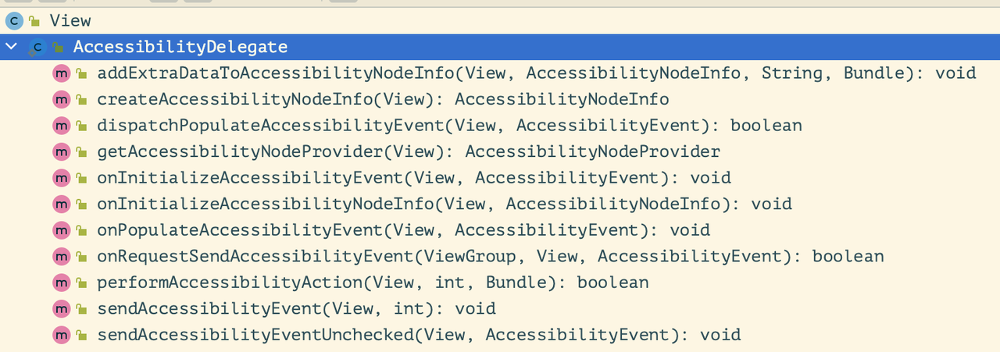

AccessibilityDelegate中对应方法的默认实现
- [View#onInitializeAccessibilityEvent(AccessibilityEvent)](https://developer.android.com/reference/android/view/View#onInitializeAccessibilityEvent(android.view.accessibility.AccessibilityEvent))

```java
/**
 * #onInitializeAccessibilityEvent 的默认实现
 *
 * @see #onInitializeAccessibilityEvent(AccessibilityEvent)
 *
 * Note: Called from the default {@link AccessibilityDelegate}.
 *
 * @hide
 */
@UnsupportedAppUsage
public void onInitializeAccessibilityEventInternal(AccessibilityEvent event) {
    event.setSource(this);
    event.setClassName(getAccessibilityClassName());
    event.setPackageName(getContext().getPackageName());
    event.setEnabled(isEnabled());
    event.setContentDescription(mContentDescription);
    event.setScrollX(getScrollX());
    event.setScrollY(getScrollY());

    switch (event.getEventType()) {
        case AccessibilityEvent.TYPE_VIEW_FOCUSED: {
            ArrayList<View> focusablesTempList = (mAttachInfo != null)
                    ? mAttachInfo.mTempArrayList : new ArrayList<View>();
            getRootView().addFocusables(focusablesTempList, View.FOCUS_FORWARD, FOCUSABLES_ALL);
            event.setItemCount(focusablesTempList.size());
            event.setCurrentItemIndex(focusablesTempList.indexOf(this));
            if (mAttachInfo != null) {
                focusablesTempList.clear();
            }
        } break;
        case AccessibilityEvent.TYPE_VIEW_TEXT_SELECTION_CHANGED: {
            CharSequence text = getIterableTextForAccessibility();
            if (text != null && text.length() > 0) {
                event.setFromIndex(getAccessibilitySelectionStart());
                event.setToIndex(getAccessibilitySelectionEnd());
                event.setItemCount(text.length());
            }
        } break;
    }
}
```

- [View#onInitializeAccessibilityNodeInfo(AccessibilityNodeInfo)](https://developer.android.com/reference/android/view/View#onInitializeAccessibilityNodeInfo(android.view.accessibility.AccessibilityNodeInfo))

```java
/**
 * #onInitializeAccessibilityNodeInfo 的默认实现
 *
 * @see #onInitializeAccessibilityNodeInfo(AccessibilityNodeInfo)
 *
 * Note: Called from the default {@link AccessibilityDelegate}.
 *
 * @hide
 */
public void onInitializeAccessibilityNodeInfoInternal(AccessibilityNodeInfo info) {
    if (mAttachInfo == null) {
        return;
    }

    Rect bounds = mAttachInfo.mTmpInvalRect;

    getDrawingRect(bounds);
    info.setBoundsInParent(bounds);

    getBoundsOnScreen(bounds, true);
    info.setBoundsInScreen(bounds);

    ViewParent parent = getParentForAccessibility();
    if (parent instanceof View) {
        info.setParent((View) parent);
    }

    if (mID != View.NO_ID) {
        View rootView = getRootView();
        if (rootView == null) {
            rootView = this;
        }

        View label = rootView.findLabelForView(this, mID);
        if (label != null) {
            info.setLabeledBy(label);
        }

        if ((mAttachInfo.mAccessibilityFetchFlags
                & AccessibilityNodeInfo.FLAG_REPORT_VIEW_IDS) != 0
                && Resources.resourceHasPackage(mID)) {
            try {
                String viewId = getResources().getResourceName(mID);
                info.setViewIdResourceName(viewId);
            } catch (Resources.NotFoundException nfe) {
                /* ignore */
            }
        }
    }

    if (mLabelForId != View.NO_ID) {
        View rootView = getRootView();
        if (rootView == null) {
            rootView = this;
        }
        View labeled = rootView.findViewInsideOutShouldExist(this, mLabelForId);
        if (labeled != null) {
            info.setLabelFor(labeled);
        }
    }

    if (mAccessibilityTraversalBeforeId != View.NO_ID) {
        View rootView = getRootView();
        if (rootView == null) {
            rootView = this;
        }
        View next = rootView.findViewInsideOutShouldExist(this,
                mAccessibilityTraversalBeforeId);
        if (next != null && next.includeForAccessibility()) {
            info.setTraversalBefore(next);
        }
    }

    if (mAccessibilityTraversalAfterId != View.NO_ID) {
        View rootView = getRootView();
        if (rootView == null) {
            rootView = this;
        }
        View next = rootView.findViewInsideOutShouldExist(this,
                mAccessibilityTraversalAfterId);
        if (next != null && next.includeForAccessibility()) {
            info.setTraversalAfter(next);
        }
    }

    info.setVisibleToUser(isVisibleToUser());

    info.setImportantForAccessibility(isImportantForAccessibility());
    info.setPackageName(mContext.getPackageName());
    info.setClassName(getAccessibilityClassName());
    info.setStateDescription(getStateDescription());
    info.setContentDescription(getContentDescription());

    info.setEnabled(isEnabled());
    info.setClickable(isClickable());
    info.setFocusable(isFocusable());
    info.setScreenReaderFocusable(isScreenReaderFocusable());
    info.setFocused(isFocused());
    info.setAccessibilityFocused(isAccessibilityFocused());
    info.setSelected(isSelected());
    info.setLongClickable(isLongClickable());
    info.setContextClickable(isContextClickable());
    info.setLiveRegion(getAccessibilityLiveRegion());
    if ((mTooltipInfo != null) && (mTooltipInfo.mTooltipText != null)) {
        info.setTooltipText(mTooltipInfo.mTooltipText);
        info.addAction((mTooltipInfo.mTooltipPopup == null)
                ? AccessibilityNodeInfo.AccessibilityAction.ACTION_SHOW_TOOLTIP
                : AccessibilityNodeInfo.AccessibilityAction.ACTION_HIDE_TOOLTIP);
    }

    // TODO: These make sense only if we are in an AdapterView but all
    // views can be selected. Maybe from accessibility perspective
    // we should report as selectable view in an AdapterView.
    info.addAction(AccessibilityNodeInfo.ACTION_SELECT);
    info.addAction(AccessibilityNodeInfo.ACTION_CLEAR_SELECTION);

    if (isFocusable()) {
        if (isFocused()) {
            info.addAction(AccessibilityNodeInfo.ACTION_CLEAR_FOCUS);
        } else {
            info.addAction(AccessibilityNodeInfo.ACTION_FOCUS);
        }
    }

    if (!isAccessibilityFocused()) {
        info.addAction(AccessibilityNodeInfo.ACTION_ACCESSIBILITY_FOCUS);
    } else {
        info.addAction(AccessibilityNodeInfo.ACTION_CLEAR_ACCESSIBILITY_FOCUS);
    }

    if (isClickable() && isEnabled()) {
        info.addAction(AccessibilityNodeInfo.ACTION_CLICK);
    }

    if (isLongClickable() && isEnabled()) {
        info.addAction(AccessibilityNodeInfo.ACTION_LONG_CLICK);
    }

    if (isContextClickable() && isEnabled()) {
        info.addAction(AccessibilityAction.ACTION_CONTEXT_CLICK);
    }

    CharSequence text = getIterableTextForAccessibility();
    if (text != null && text.length() > 0) {
        info.setTextSelection(getAccessibilitySelectionStart(), getAccessibilitySelectionEnd());

        info.addAction(AccessibilityNodeInfo.ACTION_SET_SELECTION);
        info.addAction(AccessibilityNodeInfo.ACTION_NEXT_AT_MOVEMENT_GRANULARITY);
        info.addAction(AccessibilityNodeInfo.ACTION_PREVIOUS_AT_MOVEMENT_GRANULARITY);
        info.setMovementGranularities(AccessibilityNodeInfo.MOVEMENT_GRANULARITY_CHARACTER
                | AccessibilityNodeInfo.MOVEMENT_GRANULARITY_WORD
                | AccessibilityNodeInfo.MOVEMENT_GRANULARITY_PARAGRAPH);
    }

    info.addAction(AccessibilityAction.ACTION_SHOW_ON_SCREEN);
    populateAccessibilityNodeInfoDrawingOrderInParent(info);
    info.setPaneTitle(mAccessibilityPaneTitle);
    info.setHeading(isAccessibilityHeading());

    if (mTouchDelegate != null) {
        info.setTouchDelegateInfo(mTouchDelegate.getTouchDelegateInfo());
    }

    if (startedSystemDragForAccessibility()) {
        info.addAction(AccessibilityAction.ACTION_DRAG_CANCEL);
    }

    if (canAcceptAccessibilityDrop()) {
        info.addAction(AccessibilityAction.ACTION_DRAG_DROP);
    }
}

```

调用关系 #onInitializeAccessibilityNodeInfo <-- #createAccessibilityNodeInfo

```java 
/**
 * @see #createAccessibilityNodeInfo()
 *
 * @hide
 */
public AccessibilityNodeInfo createAccessibilityNodeInfoInternal() {
    AccessibilityNodeProvider provider = getAccessibilityNodeProvider();
    if (provider != null) {
        return provider.createAccessibilityNodeInfo(AccessibilityNodeProvider.HOST_VIEW_ID);
    } else {
        AccessibilityNodeInfo info = AccessibilityNodeInfo.obtain(this);
        onInitializeAccessibilityNodeInfo(info);
        return info;
    }
}
```
哪里又调用了View#createAccessibilityNodeInfo呢？

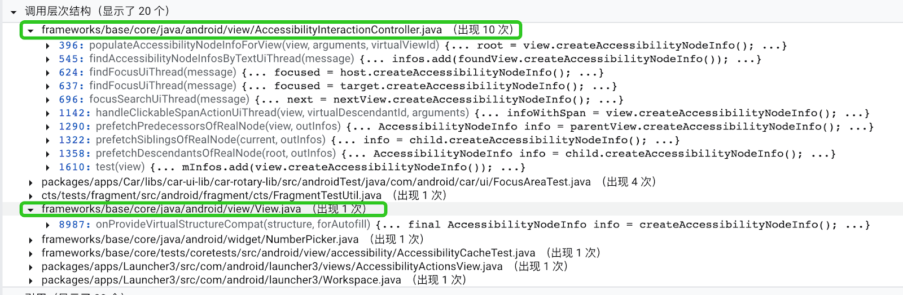

先看 View#onProvideVirtualStructure 以及 )

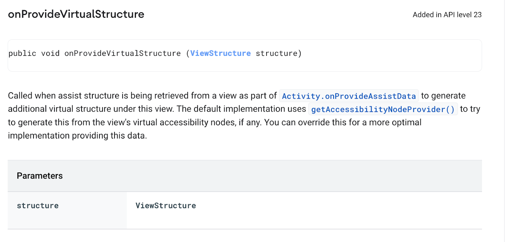

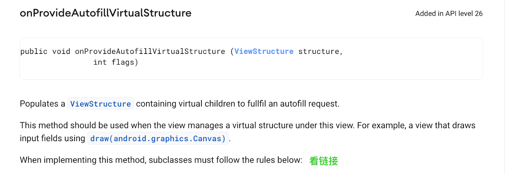

```java
// 方法体很简短
public void onProvideAutofillVirtualStructure(ViewStructure structure, int flags) {
    if (mContext.isAutofillCompatibilityEnabled()) {
        onProvideVirtualStructureCompat(structure, true);
    }
}
// 这里 isAutofillCompatibilityEnabled是什么设置呢？
// autofill指的是安卓提供的自动填充框架，了解链接
// 那么这里是在考虑自动填充框架下自定义view的表现
```

再看AccessibilityInteractionController

```java
View.createAccessibiltiyNodeInfo
-AccessibilityInteractionController.populateAccessibilityNodeInfoForView
--AccessibilityInteractionController.findAccessibilityNodeInfoByAccessibilityIdUiThread
---AccessibilityInteractionController.findAccessiibltiyNodeInfoByAccessibiltiyIdClientThread
----ViewRootImpl.findAccessibiltiyNodeInfoByAccessibilityId
-----AbstractAccessibilityServiceConnection.findAccessibilityNodeInfoByAccessibilityId
------AccessibilityInteractionClient.findAccessibilityNodeInfoByAccesssibilityId
-------AccessibilityNodeInfo.refresh
-------AccessibilityNodeInfo.getChild
-------AccessibilityNodeInfo.getNodeForAccessibilityId
-------...
-----ActionPlacingCallback.constructor
------AbstractAccessibilityServiceConnection.replaceCallbackIfNeeded
-------AbstractAccessibilityServiceConnection.findAccessibilityNodeInfosByViewId
-------AbstractAccessibilityServiceConnection.findAccessibilityNodeInfosByText
-------AbstractAccessibilityServiceConnection.findAccessibilityNodeInfoByAccessibilityId
-------AbstractAccessibilityServiceConnection.findFocus
-------AbstractAccessibilityServiceConnection.focusSearch

-AccessibilityInteractionController.findAccessibiltiyNodeInfosByTextUiThread
--AccessibilityInteractionController.findAccessibilityNodeInfosByTextClientThread
---ViewRootImpl.findAccessibilityNodeInfosByText
----AbstractAccessibilityServiceConnection.findAccessibilityNodeInfosByText
-----AccessibilityInteractionClient.findAccessibilityNodeInfosByText
------AccessibilityNodeInfo.findAccessibilityNodeInfosByText

-AccessibilityInteractionController.findFousUiThread
--AccessibilityInteractionController.findFocusClientThread
---ViewRootImpl.findFocus
----AbstractAccessibilityServiceConnection.findFocus
-----AccessibilityInteractionClient.findFocus
------AccessibilityService.findFocus
------AccessibilityNodeInfo.findFocus
------AccessibilityManagerService.getAccessibilityFocusNotLocked
-------AccessibilityManagerService.performActionOnAccessibilityFocusedItemNotLocked
--------AccessibilityManagerService.performActionOnAccessibilityFocusedItem
---------TouchExplorer.onDoubleTap
----------GetureManifold.onGestureCompleted
-------AccessibilityManagerService.getAccessibilityFocusClickPointInScreenNotLocked
--------AccessibilityManagerService.getAccessibilityFocusClickPointInScreen
---------EventDispatcher.computeClickLocation
----------EventDispatcher.longPressWithTouchEvents
-----------TouchExplorer.onDoubleTapAndHold
------------GetureManifold.onGestureCompleted
----------EventDispatcher.clickWithTouchEvents
-----------TouchExplorer.onDoubleTap
------------GetureManifold.onGestureCompleted
------UiAutomation.findFocus

-AccessibilityInteractionController.handleClickableSpanActionUiThread
--AccessibilityInteractionController.performAccessibilityActionUiThread
---AccessibilityInteractionController.performAccessibilityActionClientThread
----ViewRootImpl.performAccessibilityAction
-----AbstractAccessibilityServiceConnection.performAccessibilityActionInternal
------AbstractAccessibilityServiceConnection.performAccessibilityAction
-------AccessibilityInteractionClient.performAccessibilityAction
--------AccessibilityNodeInfo.performAction
---------@lixiaowei.xw 又到AccessibilityManagerService 之后TouchExplorer
--------AccessibilityClickableSpan.onClick

-AccessibilityInteractionController.prefrechXXXX


```

## 系统AccessibilityService对自定义AccessibilityService的约束 探索
*「系统AccessibilityService」跟「父类AccessibilityService」开始混着说了，是一个意思*

以 TalkbackService 的打印节点树功能举例：
1. 首先，打印节点树的执行是 TreeDebug.logNodeTrees 来完成的
2. 调用 logNodeTrees 方法的地方是在：

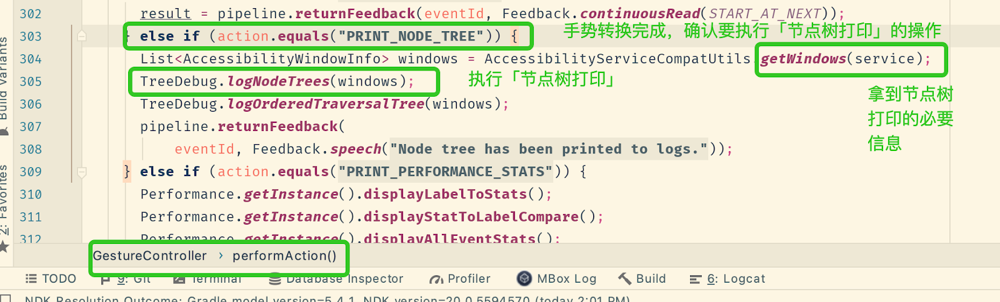

3. 通过 AccessibilityService.getWindows 拿到window信息：

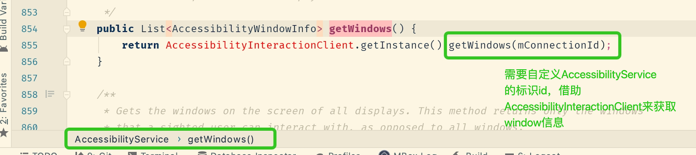

4. 转到cs网站继续看 AccessibilityInteractionClient 是怎么做 getWindows 的，以及为啥需要 connectionId（自定义AccessibilityService的标识id）

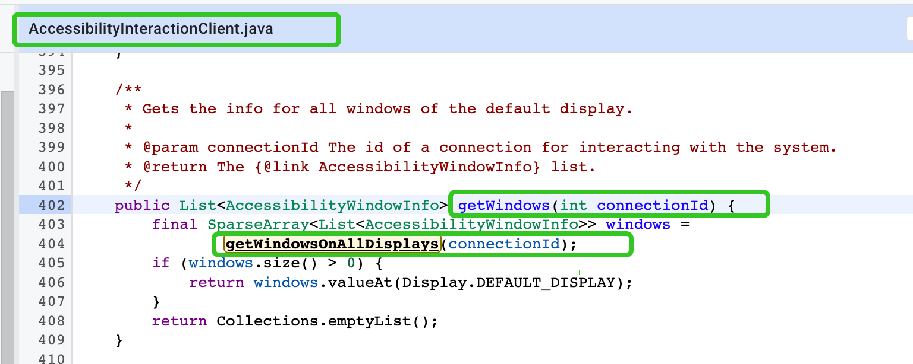

5. AccessibilityInteractionClient.getWindowsOnAllDisplays 接力，拿到在展示的window信息

```java
/**
 * 拿到在展示的windows的信息
 *
 * @param connectionId 正在与系统进行交互的自定义AccessibilityService（即对应connection）的标识id
 * @return The SparseArray of {@link AccessibilityWindowInfo} list.
 *         The key of SparseArray is display ID.
 */
public SparseArray<List<AccessibilityWindowInfo>> getWindowsOnAllDisplays(int connectionId) {
    try {
        IAccessibilityServiceConnection connection = getConnection(connectionId);
        if (connection != null) { //系统已经给自定义AccessibilityService建立了对应connection
            SparseArray<List<AccessibilityWindowInfo>> windows;
            AccessibilityCache cache = getCache(connectionId);
            if (cache != null) { //看看缓存里有有没有
                windows = cache.getWindowsOnAllDisplays();
                if (windows != null) { //缓存里有的话就直接返回了
                    return windows;
                }
            } 

            long populationTimeStamp;
            final long identityToken = Binder.clearCallingIdentity();
            try {
                populationTimeStamp = SystemClock.uptimeMillis();
                // 从connection服务获取windows信息
                windows = connection.getWindows();
            } finally {
                Binder.restoreCallingIdentity(identityToken);
            }
            if (windows != null) {
                if (cache != null) { //获取结果记录到缓存里
                    cache.setWindowsOnAllDisplays(windows, populationTimeStamp);
                }
                return windows; //返回windows信息了
            }
        } 
    } catch (RemoteException re) {
        Log.e(LOG_TAG, "Error while calling remote getWindowsOnAllDisplays", re);
    }

    final SparseArray<List<AccessibilityWindowInfo>> emptyWindows = new SparseArray<>();
    return emptyWindows; //默认返回空空如也
}
```

6. AbstractAccessibilityServiceConnection.getWindows 接力，获取windows信息

```java

@Nullable
@Override
public AccessibilityWindowInfo.WindowListSparseArray getWindows() {
    synchronized (mLock) {
        if (!hasRightsToCurrentUserLocked()) {
            return null;
        }
        //看下这个connection是不是有查询的权限
        final boolean permissionGranted =
                mSecurityPolicy.canRetrieveWindowsLocked(this);
        if (!permissionGranted) {
            return null;
        }
        //看下这个connection是不是在无障碍模式下
        if (!mSecurityPolicy.checkAccessibilityAccess(this)) {
            return null;
        }
        final AccessibilityWindowInfo.WindowListSparseArray allWindows =
                new AccessibilityWindowInfo.WindowListSparseArray();
        //求助AccessibilityWindowManager，看下在显示的区域有哪些
        final ArrayList<Integer> displayList = mA11yWindowManager.getDisplayListLocked();
        final int displayListCounts = displayList.size();
        if (displayListCounts > 0) {
            for (int i = 0; i < displayListCounts; i++) {
                final int displayId = displayList.get(i);
                ensureWindowsAvailableTimedLocked(displayId);
                // 根据一个displayId继续拿对应的展示区域下的windows信息
                final List<AccessibilityWindowInfo> windowList = getWindowsByDisplayLocked(
                        displayId);
                if (windowList != null) {
                    allWindows.put(displayId, windowList);
                }
            }
        }
        return allWindows;
    }
}

private List<AccessibilityWindowInfo> getWindowsByDisplayLocked(int displayId) {
    // 求助AccessibilityWindowManager，看下一个展示区域下的windows
    final List<AccessibilityWindowInfo> internalWindowList =
            mA11yWindowManager.getWindowListLocked(displayId);
    if (internalWindowList == null) {
        return null;
    }
    final List<AccessibilityWindowInfo> returnedWindowList = new ArrayList<>();
    final int windowCount = internalWindowList.size();
    for (int i = 0; i < windowCount; i++) {
        AccessibilityWindowInfo window = internalWindowList.get(i);
        AccessibilityWindowInfo windowClone =
                AccessibilityWindowInfo.obtain(window);
        windowClone.setConnectionId(mId);
        returnedWindowList.add(windowClone);
    }
    return returnedWindowList;
}

```

*Display是什么？逻辑上的显示区域。*
*See：https://developer.android.com/reference/android/view/Display*

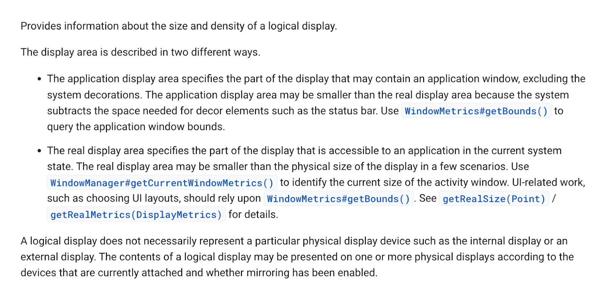

7. 上面可见要显示区域以及对应的windows信息，最终是要求助于AccessibilityWindowManager的。AccessibilityWindowManager是什么角色呢？

```java
/**
 * This class provides APIs for accessibility manager to manage {@link AccessibilityWindowInfo}s and {@link WindowInfo}s.
 */
这是源码中的注释，没有披露在developer网站上，说明不是给外部用的？

```
上面用到AccessibilityWindowManager的主要方法是：
```java
/**
 * 返回在跟踪window的一些显示区域
 *
 * @return The display list.
 */
public ArrayList<Integer> getDisplayListLocked() {
    final ArrayList<Integer> displayList = new ArrayList<>();
    final int count = mDisplayWindowsObservers.size();
    for (int i = 0; i < count; i++) {
        final DisplayWindowsObserver observer = mDisplayWindowsObservers.valueAt(i);
        if (observer != null) {
            displayList.add(observer.mDisplayId);
        }
    }
    return displayList;
}

/**
 * 返回由id指定显示区域下的windows信息
 *
 * @param displayId The logical display id.
 * @return accessibility windows for specified display.
 */
@Nullable
public List<AccessibilityWindowInfo> getWindowListLocked(int displayId) {
    final DisplayWindowsObserver observer = mDisplayWindowsObservers.get(displayId);
    if (observer != null) {
        return observer.getWindowListLocked();
    }
    return null;
}

/** List of Display Windows Observer, mapping from displayId -> DisplayWindowsObserver. */
private final SparseArray<DisplayWindowsObserver> mDisplayWindowsObservers =
        new SparseArray<>();
        
/**
 * This class implements {@link WindowManagerInternal.WindowsForAccessibilityCallback} to
 * receive {@link WindowInfo}s from window manager when there's an accessibility change in
 * window and holds window lists information per display.
 */
private final class DisplayWindowsObserver implements
        WindowManagerInternal.WindowsForAccessibilityCallback {
        ///...
        }
```

到AccessibilityWindowManager这里，可见会运用到更底层的系统能力，这层运用逻辑包装的挺严实的，通过AbstractAccessibilityServiceConnection暴露给自定义AccessibilityService使用。
事实上在打印节点树能力这条调用链 - 3 这里的开始，需要使用到 AccessibilityInteractionClient 这里就已经不在自定义AccessibilityService的可控范围内了，即被动的接受 父类AccessibilityService给出的 getWindows方法与返回结果。
最后再看看AccessibilityService中对 getWindows 方法的注释：

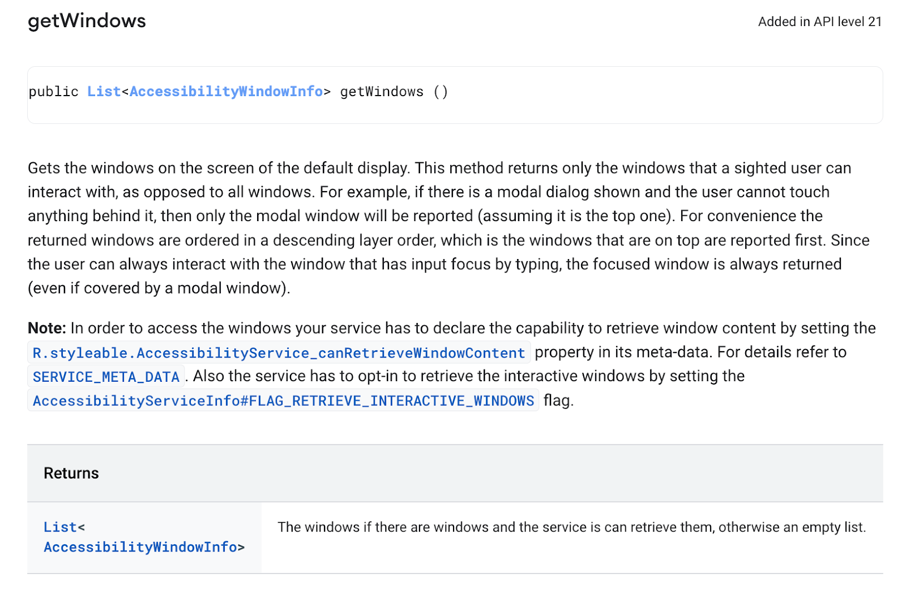

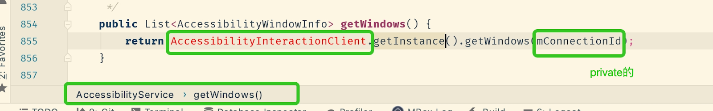

注意到在 父类AccessibilityService.getWindows 的方法中 ，必要的 mConnectionId 是private的，即无法在 自定义AccessibilityService中使用，而 AccessibilityInteractionClient 服务也无法在自定义AccessibilityService中引用到。
继续以父类AccessibilityService.getWindows 方法为例，系统AccessibilityService要使用 AccessibilityServiceConnection时，是在 AccessibilityInteractionClient中去做的（具体来说是 在AccessibilityInteractionClient.getWindows里 使用AccessibilityInteractionClient.getConnection ），而不是在 自己的类里直接使用 AccessibilityServiceConnection。
可以看下都有哪些地方调用了 AccessibilityInteractionClient.getConnection，即哪些地方要使用到 系统提供的无障碍服务接口（IAccessibilityServiceConnection.aidl）呢？👇

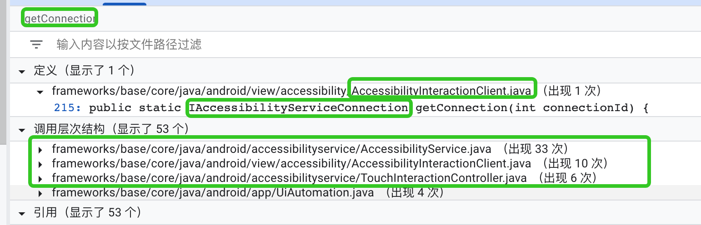

那么在自定义AccessibilityService中，能做到什么事情就全仰仗 父类 AccessibilityService 是如何使用 系统提供给外部无障碍服务的能力了，即 父类AccessibilityService 是如何使用 AbstractAccessibilityServiceConnection 提供的（IAccessibilityServiceConnection.aidl）接口，同时这些接口又在 AccessibilityInteractionClient 这再一次经手，才能够给父类AccessibilityService 使用。回到打印节点树这个例子，就是结结实实地，老实用父类AccessibilityService给的getWindows方法，无可泛化。
说到这里，应该也可以跟「无障碍时间发送原理」自洽了 //不好意思。
最后点点题，系统AccessibilityService对自定义AccessibilityService的约束 是基于继承关系，从约束 AccessibilityInteractionClient的使用开始的。

