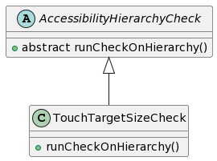
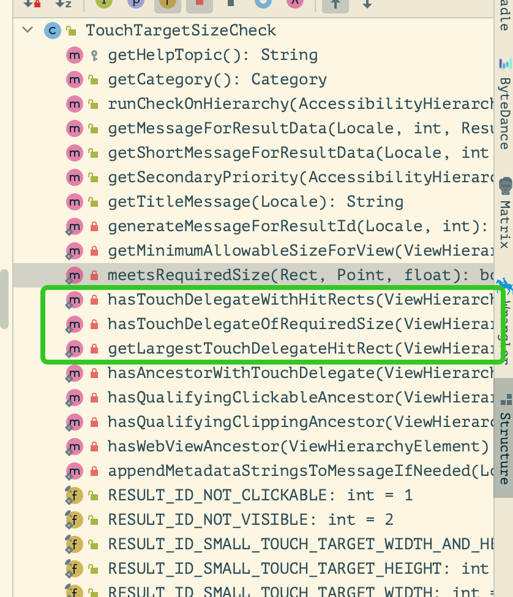

+++
title = "Accessibility Scanner 热区大小检查 Note"
date = 2022-11-16
[taxonomies]
  tags = ["note", "accessibility", "Android"]

+++

> Accessibility Scanner 未开源，了解工作原理可以参考 [Accessibility-Test-Framework-for-Android](https://github.com/google/Accessibility-Test-Framework-for-Android)

热区大小的检查是从 TouchTargetSizeCheck.runCheckOnHierarchy 开始的。
在TouchTargetSizeCheck里看到几个关键方法：
<div style="display: flex;">
    <div style="flex: 50%;">
        
    </div>
    <div style="flex: 50%;">
        
    </div>
</div>

追溯这几个关键方法的调用，可以在 runCheckOnHierarchy 中看到：
```java
@Override
public List<AccessibilityHierarchyCheckResult> runCheckOnHierarchy(
    AccessibilityHierarchy hierarchy,
    @Nullable ViewHierarchyElement fromRoot,
    @Nullable Parameters parameters) {
    //...
    
    for (ViewHierarchyElement view : viewsToEval) {
        //... 
        
        //看一下view本身的大小是不是满足要求
        if (!meetsRequiredSize(bounds, requiredSize, density)) {
            // Before we know a view fails this check, we must check if another View may be handling
            // touches on its behalf. One mechanism for this is a TouchDelegate.
            // 看看是不是用TouchDelegate满足了要求
            boolean hasDelegate = false;
            Rect largestDelegateHitRect = null;
            //有两种方法可以检查这样的delegate。
            //一种方法 在≥Q版本上可以获取到热区的具体size，这个精确点，先看看这个
            if (hasTouchDelegateWithHitRects(view)) { //检查有没有设置TouchDelegate
                hasDelegate = true;    
                //检查设置的TouchDelegate是否满足要求
                if (hasTouchDelegateOfRequiredSize(view, requiredSize, density)) {
                  // Emit no result if a delegate's hit-Rect is above the required size
                  continue;
                }
                //如果size不满足要求，找到最大的热区 记在返回里
                largestDelegateHitRect = getLargestTouchDelegateHitRect(view);
            } else {
                //如果版本低，无法知道具体size，那就检查下是不是有父项加了TouchDelegate，这说明有试图调整热区，尽管我们不知道ta调整的具体size
                hasDelegate = hasAncestorWithTouchDelegate(view);
            }
        
          //... 
        }
      //...
    }
}


/**
 * view是否设置了TouchDelegate
 */
private static boolean hasTouchDelegateWithHitRects(ViewHierarchyElement view) {
  return !view.getTouchDelegateBounds().isEmpty();
}

/**
 * 检查设置的TouchDelegate是否满足size要求
 */
private static boolean hasTouchDelegateOfRequiredSize(
    ViewHierarchyElement view, Point requiredSizeInDp, float density) {
  for (Rect hitRect : view.getTouchDelegateBounds()) {
    if (meetsRequiredSize(hitRect, requiredSizeInDp, density)) {
      return true;
    }
  }
  return false;
}

```

ViewHierarchyElement 中 touchDelegateBounds 的添加是这么做的：*取自 AccessibilityNodeInfo*
```java
@requiresApi≥Q，亦Android≥10

val hitRect = nodeInfo?.touchDelegateInfo?.getRegionAt(N)?.getBounds()
val boundsInScreen = nodeInfo?.getBoundsInScreen

hitRect + boundsInScreen 即热区size+位置
```