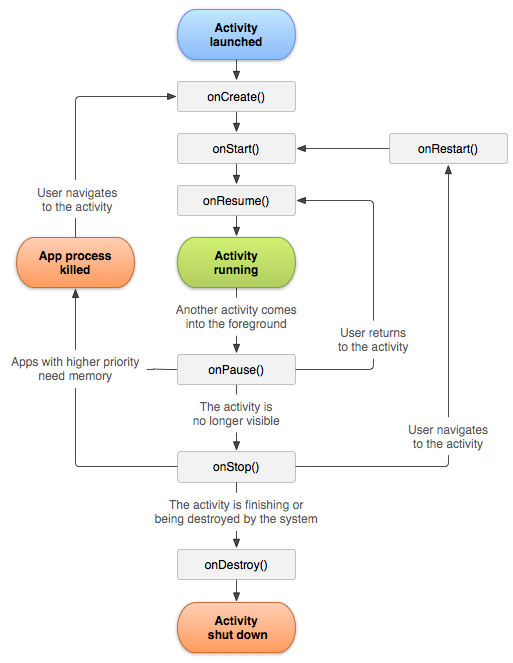
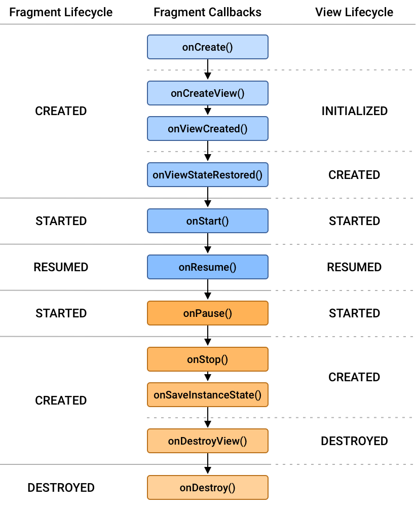

+++
title = "Four main components in Android note"
date = 2022-11-16
[taxonomies]
  tags = ["note", "components", "Android"]

+++

#### Activity, Service, BroadcastRecevier, ContentProvider


<div style="display: flex;">
  <div style="flex: 60%;">
    <!-- Your first column content here -->

**Activity lifecycle:**
```java

ActivityLaunched…
    onCreate();
    onStart();
    onResume();
    ActivityRunning…
    If activity not in foreground (but still visible):
        onPause();
        If activity is back to foreground:
            goto -> onResume();
        If activity is no longer  visible:
            onStop();
            If user navigates back to the activity:
                onRestart();
                goto -> onStart();
            If activity is killed by system due to memory allocation and now user navigates back to the activity:
                goto -> onCreate();
            onDestroy();
ActivityShutDown…

```

  </div>
  <div style="flex: 40%;" class="center">
    <!-- Your second column content here -->
    <br/>
    <br/>



  </div>
</div>


<div style="display: flex;">
  <div style="flex: 60%;">
    <!-- Your first column content here -->

**Fragment lifecycle:**

```java
FragmentAdded…
    onAttach();
    onCreate();
    onCreateView();		
    onActivityCreated();
    onStart();
    onResume();
    FragmentActive…
    If fragment is added to back stack || user navigates backward || fragment is removed/replaced:
        onPause();
        onStop();
        onDestroyView();
        If fragment returns from back stack:
            goto -> onCreateView();
        onDestroy();
        onDetach();
FragmentDestroyed…
```

  </div>
  <div style="flex: 40%;" class="center">
    <!-- Your second column content here -->
    <br/>
    <br/>



  </div>
</div>