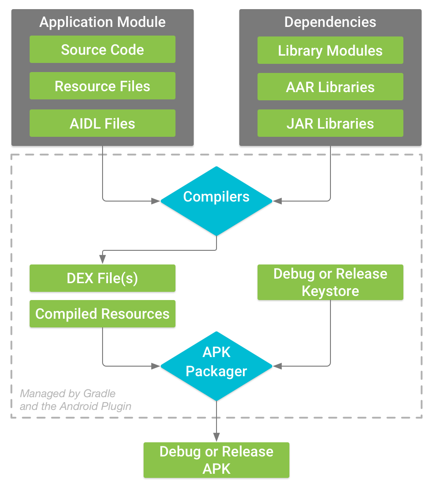

+++
title = "Android APK build process note"
date = 2022-11-16
[taxonomies]
  tags = ["note", "apk", "Android"]

+++

1. cpu架构 & 虚拟机

    i. android中不同的cpu架构：arm64、x86

    ii. 虚拟机支持不同cpu架构下编译
2. java虚拟机

    i. 支持电脑去运行由java字节码编译成的应用程序（ie 帮忙将java代码转换成机器码）

        a. 因此是可插拔的

        b. 也因此可以运行在虚拟环境中，而非只是物理硬件上

    ii. 相比于JVM，android占用更低的内存以及电池容量

        a. 至此，google采用了名为 Dalvik 的android JVM
3. 编译源码

    i. 描述android应用的java源码被javac编译器编成为一个用字节码描述的.class文件，然后才可运行在JVM上

        a. 对于kotlin源码，（当目标于JVM时）则被kotlinc编译器编成为可兼容java的字节码

        b. 字节码？软件解释器为了高效执行而设计的指令集

            - Eg java字节码即是JVM的指令集
4. android虚拟机

    i. 每个android应用运行在它自己的虚拟机上

    ii. android4.4后：ART取代了Dalvik成为google采用的新android虚拟机。ART兼容Dalvik，可以说是新版的Dalvik。

    iii. .class文件可生成JVM Java字节码
    
        a. android接受自己优化后的字节码格式，ie Dalvik字节码（当然是android4.4以前）。Dalvik字节码类似于jvm字节码，它是给处理器的机器码指令。
5. 从编译过程到 .dex

    i. 编译过程会将.class文件、.jar库文件转换成单个的classes.dex文件（以Dalvik字节码为格式的）。可以通过dx 命令来操作。

    ii. ps：‘dex’ meaning Dalvik Executable
6. ART、Dalvik

    i. android4.4后，android从Dalvik迁移到了ART，当然了 ART这个执行环境也能执行.dex文件

    ii. ART vs Dalvik

        a. app在ART上的运行&启动都更快，因为：dex字节码在安装阶段已经被转换成了机器码，所以在运行阶段没有它的编译时间了

        b. 基于Jit编译的Dalvik有什么不好呢？poor电池周期、应用延迟 等性能问题

        c. ART是基于预先（AheadOfTime）编译的，ie 编译发生在应用启动前，aka 编译在应用安装时完成（虽然带来更长的安装时间，但优化了性能问题）
        
        d. note：dalvik字节码格式仍在使用（ie .dex）
        
            - android7.0后，Jit回归了。。 混合的环境结合了Jit编译器&ART的特点
        
            - android的字节码执行环境很重要：它参与了应用的启动&安装过程
7. 编译步骤（ref：https://developer.android.com/studio/build）
 Generated 
    
    

8. 源码
    
    i. java、kotlin源码放在 /src 文件夹下
9. 资源文件
    
    i. 资源文件都在 /res 文件夹下
10. aidl文件
    
    i. Android Interface Definition Language允许自定义给用户的编程接口、以及基于IPC的通信服务
    
        a. IPC指进程间通信（interprocess communication）
    
        b. aidl可以作用于android上的任何进程
11. 库模块
    
    i. 库模块包括java、kotlin类，android组件，一些资源文件
    
    ii. 库模块是个编译已完成的产物
12. aar库
    
    i. android库被编译成为了android档案（AAR文件），它可以被android app模块们添加作为依赖
    
    ii. aar文件可以包含android资源以及一个manifest文件，这让人能将一些共享资源如布局&drawable文件  与java/kotlin类&方法绑定在一起
13. jar库
    
    i. jar是一个java 库，它不像aar一样可以包含android资源/清单文件
14. android资源打包工具 - AAPT
    
    i. Android asset packaging tool（现在是aapt2）将android Manifest与资源文件打包成为一个apk
    
    ii. 它有2步：编译 & 链接
    
        a. 它具有性能上的优势：当一个文件被修改时，它只需将这一个文件重新编译并通过‘link’指令与其他文件链接
    
        b. aapt2支持编译所有类型的android资源，如drawables、xml文件
    
            - 使用aapt2时，需要将单个资源文件作为输入来触发；aapt2将解析这些文件，然后生成一个中间的二进制文件（.flat）；在链接阶段，编译产生的所有中间文件被合并到一起，并输出为一个.apk文件（这个阶段也能生成R.java & proguard-rules）
15. resources.arsc
    
    i. apk文件包含androidManifest、二进制xml文件、resources.arsc
    
    ii. resuorces.arsc包含所有meta信息，包括一个资源，eg 包内所有资源文件的一个索引
    
    iii. R.java是apk签名后的id映射表，是Java源码可以在编译的时候使用资源
    
    iv. arsc是应用在执行时使用的资源的索引
16. D8、R8
    
    i. 从androidStudio3.1开始，D8成为了默认的编译器
    
        a. D8提供更小的dex文件，并具有更好的性能
    
        b. D8将class文件转换成dex文件，还将java8函数转换成android可执行的字节码
    
    ii. R8也是用于编译源码的，R8是D8的优化版
    
        a. R8进一步优化了dex字节码；R8还提供优化代码、混淆、移除无用类 等功能
    
            - 混淆可以通过缩短类名、方法名、域名 来减小app大小；混淆还可以抵抗简单的逆向工程，但它的主要目标还是为了减小体积
    
            - 优化代码可以通过重写不必要的代码、内联 来减小dex文件大小
17. dex、multidex
    
    i. R8的输出中有一个dex文件 名为 classes.dex
    
    ii. 对于超过64k的编译文件个数，要么删掉点无用代码并使用R8，要么就使用multidex
18. apk签名
    
    i. 所有apk在设备上安装/升级时都需要一个电子签名
    
    ii. 对于debug构建，androidStudio在运行时 使用android sdk工具自动生成的debug证书 自动为app签名了（debug keyStore & debug证书是自动生成的）
    
    iii. 对于release构建，则需要一个自己的keyStore、并上传一个key来构建一个签名的app