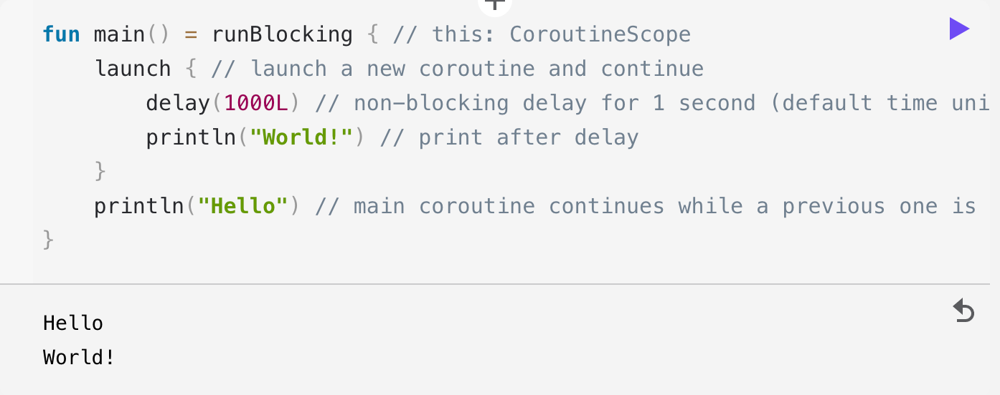
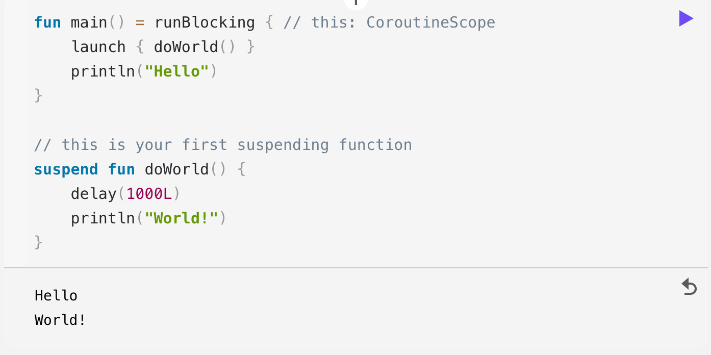
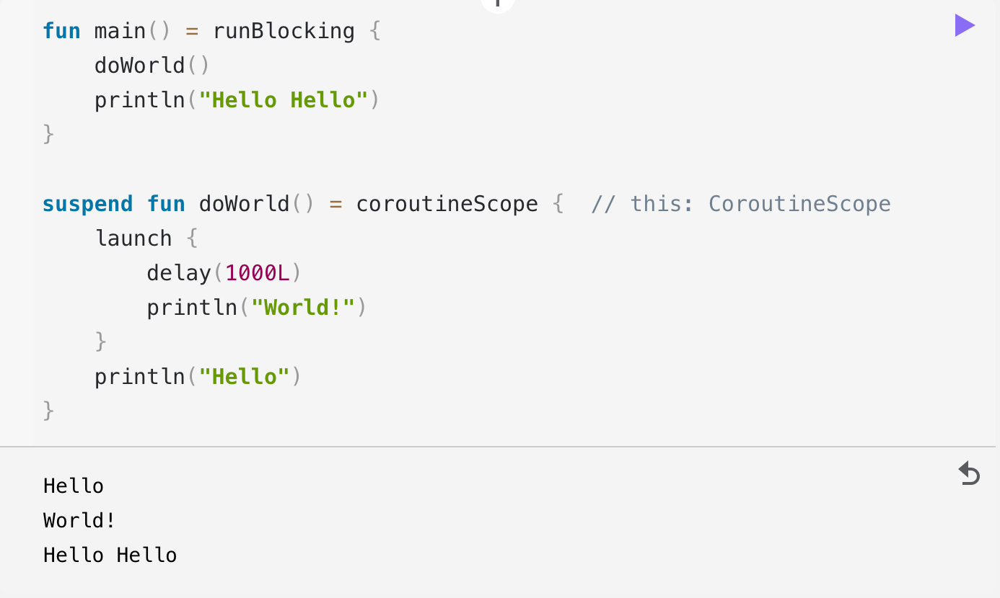
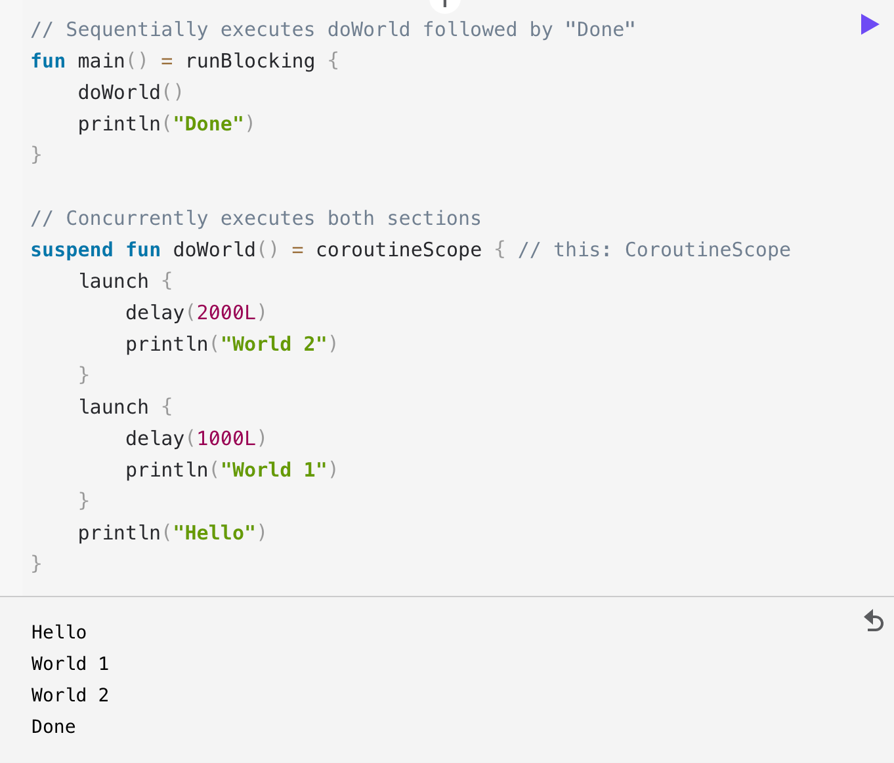

+++
title = "Kotlin Coroutine Note"
date = 2022-11-16
[taxonomies]
  tags = ["note", "kotlin", "Android", "coroutine"]

+++

# How to write a coroutine?
- Simple

- With a suspend func

- With self-declaring coroutineScope

- Launch 2 concurrent coroutines


一个 launch 包住的代码块就是协程。执行&挂起都是一这一个代码块为单位。大家都说协程可以 “同步地写异步的代码”，这一点是怎么做到的呢。我在字节内看到了一个写的很清晰的文章，好可惜呀不能放到外网来。我便照猫画虎吧，试图写写，根据那篇很棒的文章，我是怎么认识的协程。

上面贴的是官方的 first guide，协程就是这么写的。在工程里有各种各样的写法，看得我眼花缭乱不止，还产生了一些误解，还是先从简单的官方写法看起吧。

首先协程是怎么写的已经清楚，那么协程是怎么做到“同步写异步代码”的呢。它的底层仍是要把东西放到线程里去，就是 java.lang.Thread 里，以及仍是要利用 java.lang.Runnable，这些多线程的原生接口。经过了很好的包装之后，我们的写法可以从异步的写进化到同步的写，这大概就是协程做的事情。除此之外，协程的特点是轻量，直观地表示则是执行10000个协程占用的 memory 比 执行10000个 Thread 所占用 的memory 要少的多，这个又是怎么做到的呢？

那么带着两个主要问题开始吧：1协程的工作原理，具体来说，怎么做到执行&挂起的，2协程的轻量是怎么实现的。

# 探索 协程的执行&挂起
搜一搜网上写的协程工作原理，他们都提到一个词 CPS，这是啥意思呢？CPS - continuation passing-style。意思就是可以把一个代码块，一个block，传来传去。协程也是借助于此，它有一个 Continuation 接口，协程把它作为执行&挂起的单位，就是我们 launch 包住的那一块代码啦。

来从 launch 开始看：
```kotlin
//kotlinx-coroutines-core:Builders.common.kt
public fun CoroutineScope.launch(
    context: CoroutineContext = EmptyCoroutineContext, //默认空的上下文
    start: CoroutineStart = CoroutineStart.DEFAULT,    //默认马上开始
    block: suspend CoroutineScope.() -> Unit           //我们的代码块
): Job {
    val newContext = newCoroutineContext(context)
    val coroutine = if (start.isLazy)
        //如果start参数指定了 CoroutineStart.LAZY
        LazyStandaloneCoroutine(newContext, block) else
        //标准start
        StandaloneCoroutine(newContext, active = true) 
    //这就start了，关注下我们的block上哪去了，这里注意 invoke 的语法糖
    coroutine.start(start, coroutine, block)
    return coroutine
}

```

关注这个 block 被传递到哪里去了，因为协程的最后目的就是执行它。上边 block 被传到了 coroutine.start 去，就是 AbstractCoroutine 的 start，然后又传去了 CoroutineStart 的 invoke 方法。

```kotlin
//kotlinx-coroutines-core:AbstractCoroutine.kt
    public fun <R> start(start: CoroutineStart, receiver: R, block: suspend R.() -> T) {
        initParentJob()
        start(block, receiver, this)
    }
```

<br/>

```kotlin
//kotlinx-coroutines-core:CoroutineStart.kt
    public operator fun <R, T> invoke(block: suspend R.() -> T, receiver: R, completion: Continuation<T>): Unit =
        when (this) {
            DEFAULT -> block.startCoroutineCancellable(receiver, completion)
            ATOMIC -> block.startCoroutine(receiver, completion)
            UNDISPATCHED -> block.startCoroutineUndispatched(receiver, completion)
            LAZY -> Unit // will start lazily
        }
```

到这里我们知道，在 CoroutineStart.DEFAULT 时就对 block 调用了限制函数 startCoroutineCancellable，继续关注它。

```kotlin
//kotlinx-coroutines-core:Cancellable.kt
internal fun <R, T> (suspend (R) -> T).startCoroutineCancellable(
    receiver: R, completion: Continuation<T>,
    onCancellation: ((cause: Throwable) -> Unit)? = null
) =
    runSafely(completion) {
        createCoroutineUnintercepted(receiver, completion).intercepted().resumeCancellableWith(Result.success(Unit), onCancellation)
    }
```
虽然格式乱掉了，但是没关系，可以看到走了好长一串调用链，这条链上第一步 createCoroutineUnintercepted 就是把我们的 block 转换成了 kotlin 用的Continuation。

```kotlin
public fun <R, T> (suspend R.() -> T).createCoroutineUnintercepted(receiver: R, completion: kotlin.coroutines.Continuation<T>): kotlin.coroutines.Continuation<kotlin.Unit> { /* compiled code */ }
```

找这个方法的源码可真不容易，跳转来跳转去都是 compiled code（在看 kotlin 源码的时候经常碰到这种情况），之后有看注释里的引用，结果跳转到了 kotlin-stdlib:intrinsicsJvm.kt 里，（这是个 jvm 方法所以不能直接index到吗？）。然后看看这里吧，跟其他源码解释的出处似乎也是一致的：
```kotlin
public actual fun <T> (suspend () -> T).createCoroutineUnintercepted(
    completion: Continuation<T>
): Continuation<Unit> {
    //load一个 completion:Continuation 作为协程执行结束的回调
    val probeCompletion = probeCoroutineCreated(completion)
    return if (this is BaseContinuationImpl)
        create(probeCompletion)
    else
        createCoroutineFromSuspendFunction(probeCompletion) {
            (this as Function1<Continuation<T>, Any?>).invoke(it)
        }
}
```

这里第一步先通过 probeCoroutineCreated 包装了一个 completion:Continuation 作为协程执行结束时的回调。之后看看是不是suspend函数，再来create一个 Continuation 。
这里 probeCoroutineCreated 是在这样一个流程中起了作用 （from kotlin 注释）：


不管是哪一种create，都是创建了一个 BaseContinuationImpl 类然后返回。
所以长长的调用链：`createCoroutineUnintercepted(receiver, completion).intercepted().resumeCancellableWith(Result.success(Unit), onCancellation)` 在第一环结束时是创建了一个 BaseContinuationImpl，然后就是：`BaseContinuationImpl.intercepted().resumeCancellableWith(Result.success(Unit), onCancellation)`

继续关注调用链后边的环节吧。

从注释看，主要是 coroutine framework 在使用它，是要看看 Continuation 的上下文里有没有 ContinuationInterceptor 想来做一些事情比如缓存。之后继续返回一个 Continuation。

```kotlin
/**
 * Intercepts this continuation with [ContinuationInterceptor].
 *
 * This function shall be used on the immediate result of [createCoroutineUnintercepted] or [suspendCoroutineUninterceptedOrReturn],
 * in which case it checks for [ContinuationInterceptor] in the continuation's [context][Continuation.context],
 * invokes [ContinuationInterceptor.interceptContinuation], caches and returns the result.
 *
 * If this function is invoked on other [Continuation] instances it returns `this` continuation unchanged.
 */
@SinceKotlin("1.3")
public actual fun <T> Continuation<T>.intercepted(): Continuation<T> =
    (this as? ContinuationImpl)?.intercepted() ?: this
```

intercepted这里具体做了什么暂时好像没啥可关心的，继续看长长调用链的下一步：`BaseContinuationImpl.resumeCancellableWith(Result.success(Unit), onCancellation)`
这里看起来也就是最后一步了，原来是因为名字取得太长才显得链条长吗。
Anyway, 来看看 BaseContinuationImpl#resumeWith 吧。
（什么？不是resumeCancellableWith吗？哦，因为还是到resumeWith来了呀。）

```kotlin
    // This implementation is final. This fact is used to unroll resumeWith recursion.
    public final override fun resumeWith(result: Result<Any?>) {
        // This loop unrolls recursion in current.resumeWith(param) to make saner and shorter stack traces on resume
        var current = this
        var param = result
        while (true) {
            // Invoke "resume" debug probe on every resumed continuation, so that a debugging library infrastructure
            // can precisely track what part of suspended callstack was already resumed
            probeCoroutineResumed(current)
            with(current) {
                val completion = completion!! // fail fast when trying to resume continuation without completion
                val outcome: Result<Any?> =
                    try {
				//invoke我们的代码块
                        val outcome = invokeSuspend(param)
				//代码块执行结果是 COROUTINE_SUSPENDED的话就挂起，这里会return，结束执行
                        if (outcome === ) return
				//协程或代码块 执行成功
                        Result.success(outcome)
                    } catch (exception: Throwable) {
				//协程或代码块 执行有问题
                        Result.failure(exception)
                    }
                releaseIntercepted() // this state machine instance is terminating
                if (completion is BaseContinuationImpl) {
                    // unrolling recursion via loop
                    current = completion
                    param = outcome
                } else {
                    // top-level completion reached -- invoke and return
                    completion.resumeWith(outcome)
                    return
                }
            }
        }
    }

```